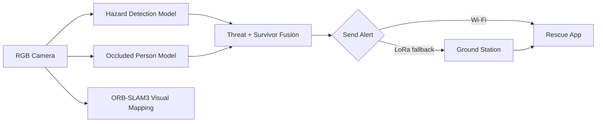

# RUBIQX · ARGUS

<p align="center">
  
  
  
  
</p>

<p align="center">
  <strong>Autonomous Search-and-Rescue Intelligence Platform</strong>
</p>

ARGUS is a research-driven autonomous search-and-rescue (SAR) intelligence platform designed for disaster response scenarios where conventional infrastructure is compromised. Developed for SIH'26, the system integrates AI-powered hazard detection, occluded-person recognition, visual odometry and SLAM, telemetry interfaces, and responsive alert workflows to support field operations in GPS-denied and low-visibility environments.

The platform is intended to help rescue teams detect survivors faster, identify hazards earlier, understand mission context in real time, and coordinate response efforts using a unified dashboard and mobile alert pipeline.

## Mission

Search and rescue operations are time-critical, risky, and often executed under conditions where GPS, network connectivity, and situational awareness are unreliable. ARGUS addresses this challenge by combining perception, mapping, and decision support into a single operational stack for field teams.

## Why this project matters

- GPS coverage may be unavailable or degraded in disaster zones
- Smoke, debris, and occlusion reduce visibility for human operators
- First-response window is critical for survivor survival
- Communication between rescuers and command centers can be unreliable
- Locational awareness under cluttered environments remains difficult

ARGUS provides a practical, prototype-grade foundation for closing those gaps through:

- AI-based hazard and survivor detection
- visual SLAM for GPS-denied localization
- edge-ready model export workflows
- mobile and web operator interfaces
- Wi‑Fi and LoRa assisted alert propagation

## Core capabilities

| Capability | Status | Notes |
|---|---|---|
| Hazard detection (fire, smoke, crack, person) | ✅ Demonstrated | YOLOv11-based detection pipeline |
| Occluded-person detection | ✅ Demonstrated | WiderPerson-inspired training setup for partially hidden pedestrians |
| GPS-denied visual mapping | ✅ Prototype | Monocular ORB-SLAM3 prototype using laptop camera input |
| Onboard Raspberry Pi inference | 🔧 In development | NCNN export and embedded deployment planned |
| Alerting via Wi‑Fi + LoRa fallback | 🔧 In development | Integration with rescue app and mission workflows underway |
| Survivor projection and mission scoring | 📋 Planned | Requires additional sensing and logic for field deployment |
| Autonomous flight and payload logic | 📋 Planned | Future system expansion for full unmanned SAR missions |

## System architecture



## Repository overview

```text
RUBIQX/
├── app.py                     # Flask dashboard + mission intelligence server
├── run_inference.py           # Inference execution entry points
├── start_dashboard.sh         # Dashboard startup helper
├── best.pt                    # Reference YOLO checkpoint
├── best.onnx                  # ONNX export
├── hazard_fire_smoke.pt       # Fire/smoke hazard detection model
├── best_ncnn_model_*/        # NCNN model exports for edge deployment
├── SLAM/                      # Camera server, config, and ORB-SLAM3 patch set
├── ml-models/                 # Trained model assets and documentation
├── occluded_dataset/          # WiderPerson-inspired dataset and evaluation utilities
├── simulation/                # Blender-based mission visualization assets
├── mobile_app/                # Flutter-based rescue operator interface
├── docs/                      # Architecture, hardware, and alert schema documentation
├── firmware/                  # Firmware-related components
├── sar/                       # SAR / radio / packet logic
├── templates/                 # Flask UI templates
├── argus_dist/                # Frontend build/static assets
├── README.md                  # Project overview
├── LICENSE                    # Repository license (if present)
├── .gitignore
├── test_inference.py
├── calibrate_camera.py
├── export_model.py
├── rescue_location.py
├── lora_bridge.py
├── lora_uplink.py
├── lora_uplink_direct.py
├── checkradio.py
├── watchdog.py
├── vo_smoke_test.py
├── _uart_check.py
└── sample_drone.mp4
```

## Technology stack

- Languages: Python, Dart, C++, HTML, MATLAB, Shell
- Core runtime: Flask, Ultralytics YOLO, ORB-SLAM3, Raspberry Pi 5 deployment path
- AI models: YOLOv11-based hazard and occluded-person detection
- Communications: Wi‑Fi alerting with LoRa fallback
- Mobile/UX: Flutter rescue app and dashboard interfaces
- Vision stack: RGB-based perception, camera calibration, and GPS-denied mapping

## Quick start

### 1) Launch the dashboard locally

```bash
python app.py
```

Open any of the following in your browser:

- http://localhost:5000/
- http://localhost:5000/ml
- http://localhost:5000/gcs

This serves the mission dashboard, AI surveillance feed, telemetry interfaces, and alert management views.

### 2) Run the SLAM prototype

This prototype is split across two environments:

#### Windows: camera stream server

```powershell
cd <path-to-clone>\SLAM
py -m venv .venv
.\.venv\Scripts\Activate.ps1
python src\camera_server.py
```

The stream is exposed at:

- http://localhost:5000/
- http://<windows-host>:5000/video

#### Ubuntu / WSL2: ORB-SLAM3 tracking

```bash
# In your ORB-SLAM3 checkout
# Apply the project patch first
git apply /path/to/RUBIQX/SLAM/patches/orb-slam3-changes.patch

WINDOWS_HOST=$(ip route | awk '/default/ {print $3; exit}')
./live_mono \
  Vocabulary/ORBvoc.txt \
  /path/to/RUBIQX/SLAM/config/LaptopCamera.yaml \
  "http://$WINDOWS_HOST:5000/video"
```

### 3) Run model inference locally

```bash
pip install ultralytics
python run_inference.py --help
```

For direct model execution:

```bash
yolo predict model=ml-models/disaster-mlmodel.pt source=path/to/image.jpg
```

For Raspberry Pi edge export:

```bash
yolo export model=ml-models/disaster-mlmodel.pt format=ncnn
```

## Project status and roadmap

### Current state

This repository represents a credible prototype and research foundation for autonomous SAR intelligence. It combines working components across perception, visual mapping, dashboard interfaces, and communications-related alert logic. The project is not yet a complete field-deployable autonomous rescue platform, but it demonstrates the core technical feasibility of an integrated disaster-response system.

### Planned next steps

- production-grade onboard Raspberry Pi 5 deployment
- improved survivor localization using heading and range estimation
- latency benchmarking and reliability testing for alert propagation
- autonomous flight safety and payload release logic
- thermal and acoustic sensing integration
- end-to-end field validation with hardware-in-the-loop testing

## Dataset and attribution

The project includes a WiderPerson-inspired occlusion dataset for dense pedestrian detection under partial obstruction.

Please see:

- `occluded_dataset/README.md`
- `docs/architecture.md`

Citation:

> Zhang, S., Xie, Y., Wan, J., Xia, H., Li, S. Z., & Guo, G. (2020). WiderPerson: A Diverse Dataset for Dense Pedestrian Detection in the Wild. IEEE Transactions on Multimedia.

## Documentation

For deeper technical context, explore the project documentation:

- [`docs/architecture.md`](docs/architecture.md) — system architecture and mission concept
- [`docs/hardware_abstraction.md`](docs/hardware_abstraction.md) — hardware path from prototype to deployment
- [`docs/alert_schema.md`](docs/alert_schema.md) — Wi‑Fi and LoRa alert modeling
- [`SLAM/README.md`](SLAM/README.md) — ORB-SLAM3 prototype notes
- [`ml-models/README.md`](ml-models/README.md) — model definitions and deployment guidance
- [`occluded_dataset/README.md`](occluded_dataset/README.md) — dataset expectations and evaluation context

## Team

RUBIQX — SIH'26 team project by [ASH-LABS-02](https://github.com/ASH-LABS-02).

## License and usage note

This repository includes third-party components and datasets, including ORB-SLAM3 and the WiderPerson benchmark. Please respect the applicable licensing and attribution requirements for those upstream projects when using, adapting, or distributing this work.

---

This project is positioned as a research prototype for autonomous disaster response intelligence and is intended to support further development in edge AI, mapping, field operations, and mission coordination.
