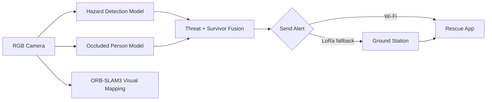

# RUBIQX · ARGUS

<p align="center">
  
  
  
  
</p>

ARGUS is an autonomous search-and-rescue (SAR) drone intelligence platform developed for SIH'26. The system integrates real-time hazard detection, occluded-person detection, visual odometry/SLAM, and rescue-alert orchestration to support fast situational awareness in disaster zones.

Built for disaster-response scenarios where GPS may fail or visibility is limited, ARGUS focuses on detecting survivors, recognizing hazards, estimating mission context, and sending alerts through resilient communication pathways.

## Why this project matters

Search and rescue operations are time-critical and high-risk. In disaster environments, teams may face:

- poor or unavailable GPS coverage
- limited visibility due to smoke, debris, or occlusion
- delayed situational awareness during the critical first response window
- communication constraints between the field and command centers

ARGUS addresses this by combining:

- AI-based survivor and hazard detection
- GPS-denied visual mapping using ORB-SLAM3
- onboard Raspberry Pi dashboard and alert system
- Wi‑Fi and LoRa relay workflows for incident alerting
- a Flutter-based rescue app interface

## Core capabilities

| Capability | Status | Notes |
|---|---|---|
| Hazard detection (fire, smoke, crack, person) | ✅ Demonstrated | YOLOv11-based detection pipeline |
| Occluded-person detection | ✅ Demonstrated | Trained on WiderPerson-style occlusion data |
| GPS-denied visual mapping | ✅ Prototype | Monocular ORB-SLAM3 prototype using laptop camera |
| Raspberry Pi onboard inference | 🔧 In development | NCNN export and edge deployment planned |
| Alerting via Wi‑Fi + LoRa fallback | 🔧 In development | Rescue app integration under progress |
| Survivor projection and mission scoring | 📋 Planned | Additional sensing and logic required |
| Autonomous flight and payload release | 📋 Planned | Future system expansion |

## System overview



## Repository structure

```text
RUBIQX/
├── app.py                     # Flask dashboard + mission intelligence server
├── run_inference.py           # Inference execution entry points
├── start_dashboard.sh         # Dashboard startup helper
├── best.pt                    # Reference YOLO model checkpoint
├── best.onnx                  # ONNX export
├── hazard_fire_smoke.pt       # Fire/smoke hazard detection model
├── best_ncnn_model_*/        # NCNN exports for edge deployment
├── SLAM/                      # Camera server, config, ORB-SLAM3 patch set
├── ml-models/                 # Trained detection models and documentation
├── occluded_dataset/          # WiderPerson-based data and MATLAB evaluation tools
├── simulation/                # Blender-based mission visualization assets
├── mobile_app/                # Flutter mobile rescue app
├── docs/                      # Architecture, hardware, and alert schema docs
├── firmware/                  # Firmware-related components
├── sar/                       # SAR / radio / packet logic
├── templates/                 # Flask UI templates
├── argus_dist/                # Frontend build/static assets
├── README.md                  # Project overview
├── LICENSE                    # repository license if present
└── .gitignore
```

## Tech stack

- Languages: Python, Dart, C++, HTML, MATLAB
- Core runtime: Flask, Ultralytics YOLO, ORB-SLAM3, Raspberry Pi 5 deployment path
- AI models: YOLOv11-based hazard and occluded-person detectors
- Communication: Wi‑Fi alert flow with LoRa fallback
- Mobile/UX: Flutter rescue app

## Quick start

### 1) Launch the dashboard locally

```bash
python app.py
```

Then open:

- http://localhost:5000/
- http://localhost:5000/ml
- http://localhost:5000/gcs

This application provides the dashboard, AI surveillance feed, mission telemetry, and alert interfaces.

### 2) Run the SLAM prototype

This prototype splits work across two environments.

#### Windows: camera stream server

```powershell
cd <path-to-clone>\SLAM
py -m venv .venv
.\.venv\Scripts\Activate.ps1
python src\camera_server.py
```

The stream is exposed at:

- http://localhost:5000/
- http://<windows-host>:5000/video

#### Ubuntu / WSL2: ORB-SLAM3 tracking

```bash
# In your ORB-SLAM3 checkout
# apply the project patch first
git apply /path/to/RUBIQX/SLAM/patches/orb-slam3-changes.patch

WINDOWS_HOST=$(ip route | awk '/default/ {print $3; exit}')
./live_mono \
  Vocabulary/ORBvoc.txt \
  /path/to/RUBIQX/SLAM/config/LaptopCamera.yaml \
  "http://$WINDOWS_HOST:5000/video"
```

### 3) Run model inference locally

```bash
pip install ultralytics
yolo predict model=ml-models/disaster-mlmodel.pt source=path/to/image.jpg
```

For Pi deployment/export:

```bash
yolo export model=ml-models/disaster-mlmodel.pt format=ncnn
```

## Project status and roadmap

### Current state

The repository is a strong research and prototype base, with working components across AI, mapping, and mission dashboards. It is not yet a complete autonomous rescue platform, but it demonstrates the critical building blocks.

### Planned next steps

- production-grade onboard Pi 5 deployment
- improved survivor localization using heading + range estimation
- alert latency benchmarking and LoRa reliability checks
- autonomous flight and payload safety logic
- thermal and acoustic sensing integration
- end-to-end field validation with hardware-in-the-loop testing

## Dataset and attribution

The repository includes a WiderPerson-derived occlusion dataset for dense pedestrian detection under partial obstruction.

Please see:

- `occluded_dataset/README.md`
- `docs/architecture.md`

Citation:

> Zhang, S., Xie, Y., Wan, J., Xia, H., Li, S. Z., & Guo, G. (2020). WiderPerson: A Diverse Dataset for Dense Pedestrian Detection in the Wild. IEEE Transactions on Multimedia.

## Documentation

For deeper technical context, start here:

- [`docs/architecture.md`](docs/architecture.md) — system architecture and mission concept
- [`docs/hardware_abstraction.md`](docs/hardware_abstraction.md) — hardware path from prototype to deployment
- [`docs/alert_schema.md`](docs/alert_schema.md) — Wi‑Fi and LoRa alert modeling
- [`SLAM/README.md`](SLAM/README.md) — ORB-SLAM3 prototype details
- [`ml-models/README.md`](ml-models/README.md) — model definitions and deployment notes
- [`occluded_dataset/README.md`](occluded_dataset/README.md) — dataset expectations and evaluation context

## Team

RUBIQX — SIH'26 team project by [ASH-LABS-02](https://github.com/ASH-LABS-02).

## License and usage note

This repository includes third-party tooling and data, including ORB-SLAM3 and the WiderPerson benchmark. Respect the applicable licensing and attribution requirements for those upstream components when using the project beyond the prototype scope.

---

If you want, I can now also prepare a more premium version with:

- a hero banner image section
- badges for model types / stack / hardware
- architecture screenshot placeholders
- a more polished “Problem → Solution → Impact” story for SIH judges and reviewers
