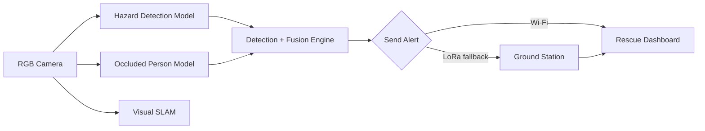

# RUBIQX · ARGUS

<p align="center">
  
  
  
  
</p>

<p align="center">
  <strong>Autonomous Search-and-Rescue Intelligence Platform</strong>
</p>

ARGUS is a research-driven autonomous search-and-rescue intelligence system designed for disaster-response scenarios where conventional infrastructure is disrupted, communication is unreliable, and time-critical rescue operations depend on rapid situational awareness.

This repository presents a prototype-grade foundation for AI-assisted disaster response, combining real-time hazard detection, GPS-denied visual mapping, operator dashboards, and communication fallback strategies for rescue coordination.

## Problem Statement

Search and rescue missions are often executed under extreme conditions:

- GPS coverage may be unavailable or degraded
- Smoke, debris, and occlusion reduce visibility
- First-response time is critical for survival outcomes
- Communication between field teams and command centers can fail
- Operators need actionable intelligence under uncertain conditions

ARGUS addresses these challenges by unifying perception, mapping, and operator support into a single disaster-response platform.

## Mission

Our mission is to build a robust, edge-ready intelligence layer for emergency response operations that helps teams:

- detect hazards such as fire, smoke, cracks, and human presence
- identify survivors in partially occluded or cluttered environments
- localize and map the mission area in GPS-denied situations
- present actionable status to rescue operators through a unified interface
- relay critical alerts via resilient communication pathways

## Core Capabilities

| Capability | Status | Description |
|---|---|---|
| Hazard detection | ✅ Demonstrated | YOLO-based detection for fire, smoke, cracks, and persons |
| Occluded-person detection | ✅ Demonstrated | Specialized model for partially hidden or obstructed survivors |
| GPS-denied mapping | ✅ Prototype | Monocular visual SLAM prototype using laptop-camera input |
| Edge deployment path | 🔧 In development | NCNN export for Raspberry Pi 5 and embedded inference |
| Wi‑Fi + LoRa alerting | 🔧 In development | Field-to-command communication fallback layer |
| Mission scoring and survivor projection | 📋 Planned | GPS and heading-based estimation for target localization |
| Autonomous flight integration | 📋 Planned | Future expansion for full SAR drone operations |

## System Overview



## Why RUBIQX Matters

ARGUS is designed to reduce the time between detection and response in unsafe environments. The project aims to support emergency teams with a practical technology stack that combines:

- computer vision for hazard and survivor recognition
- SLAM-based spatial awareness in GPS-denied zones
- mobile and web interfaces for field decision-making
- resilient alert propagation for disconnected operations
- AI inference pathways suitable for edge hardware deployment

## Repository Structure

```text
RUBIQX/
├── app.py                     # Flask mission intelligence dashboard
├── run_inference.py           # Inference entry points and runtime helpers
├── start_dashboard.sh         # Dashboard startup helper
├── best.pt                    # Reference YOLO model checkpoint
├── best.onnx                  # ONNX export artifact
├── hazard_fire_smoke.pt       # Hazard detection model
├── best_ncnn_model_*/        # NCNN exports for edge deployment
├── SLAM/                     # Camera server, config, and ORB-SLAM3 patch setup
├── ml-models/                # Model assets and documentation
├── occluded_dataset/         # WiderPerson-inspired training dataset and utilities
├── simulation/               # Mission visualization and Blender-related assets
├── mobile_app/               # Flutter-based rescue operator application
├── docs/                     # Architecture, hardware, and alert schema docs
├── firmware/                 # Embedded/firmware related modules
├── sar/                      # SAR, radio, and packet logic
├── templates/                # Flask dashboard templates
├── argus_dist/               # Frontend build artifacts and static assets
├── README.md                 # Project overview
├── LICENSE                   # Repository license (if present)
├── .gitignore
├── test_inference.py
├── calibrate_camera.py
├── export_model.py
├── rescue_location.py
├── lora_bridge.py
├── lora_uplink.py
├── lora_uplink_direct.py
├── checkradio.py
├── watchdog.py
├── vo_smoke_test.py
├── _uart_check.py
├── sample_drone.mp4
└── test_sample.jpg
```

## Technology Stack

| Area | Stack |
|---|---|
| AI / Vision | Python, Ultralytics YOLO, OpenCV |
| Mapping | ORB-SLAM3, monocular visual localization |
| Web / Dashboard | Flask, HTML, CSS, JavaScript |
| Mobile App | Dart, Flutter |
| Embedded / Edge | Raspberry Pi 5, NCNN export path |
| Communication | Wi‑Fi, LoRa-based fallback signaling |
| Sensing | RGB camera, GPS, rescue telemetry, alert payload logic |

## Quick Start

### 1) Launch the dashboard

```bash
python app.py
```

Open one of the following in your browser:

- http://localhost:5000/
- http://localhost:5000/ml
- http://localhost:5000/gcs

This serves the mission dashboard, AI surveillance interface, telemetry views, and alert management screens.

### 2) Run the model inference pipeline

```bash
pip install ultralytics
python run_inference.py --help
```

For direct model execution:

```bash
yolo predict model=ml-models/disaster-mlmodel.pt source=path/to/image.jpg
```

For Raspberry Pi edge export:

```bash
yolo export model=ml-models/disaster-mlmodel.pt format=ncnn
```

### 3) Run the SLAM prototype

This prototype uses a Windows camera server and an Ubuntu/WSL2 ORB-SLAM3 workflow.

#### Windows: camera stream server

```powershell
cd <path-to-clone>\SLAM
py -m venv .venv
.\.venv\Scripts\Activate.ps1
python src\camera_server.py
```

Then run the SLAM tracker in Ubuntu or WSL2:

```bash
# In your ORB-SLAM3 checkout
# Apply the project patch first
git apply /path/to/RUBIQX/SLAM/patches/orb-slam3-changes.patch

WINDOWS_HOST=$(ip route | awk '/default/ {print $3; exit}')
./live_mono \
  Vocabulary/ORBvoc.txt \
  /path/to/RUBIQX/SLAM/config/LaptopCamera.yaml \
  "http://$WINDOWS_HOST:5000/video"
```

## Project Status and Roadmap

### Current State

This repository represents a credible prototype and research foundation for autonomous SAR intelligence. It combines working components across computer vision, mapping, web dashboards, and communication pathways to support disaster-response workflows.

### Planned Next Steps

- production-grade onboard Raspberry Pi 5 deployment
- improved survivor localization using heading and range estimation
- latency benchmarking and reliability testing for alert propagation
- autonomous flight safety and payload-release logic
- thermal and acoustic sensing integration
- field validation with hardware-in-the-loop testing

## Dataset and Attribution

The project includes a WiderPerson-inspired occluded pedestrian dataset used for detecting partially visible survivors in cluttered scenes.

Relevant references:

- `occluded_dataset/README.md`
- `docs/architecture.md`

Citation:

> Zhang, S., Xie, Y., Wan, J., Xia, H., Li, S. Z., & Guo, G. (2020). WiderPerson: A Diverse Dataset for Dense Pedestrian Detection in the Wild. IEEE Transactions on Multimedia.

## Documentation

For deeper technical context, explore:

- [`docs/architecture.md`](docs/architecture.md) — system architecture and mission concept
- [`docs/hardware_abstraction.md`](docs/hardware_abstraction.md) — deployment hardware path
- [`docs/alert_schema.md`](docs/alert_schema.md) — Wi‑Fi and LoRa alert modeling
- [`SLAM/README.md`](SLAM/README.md) — ORB-SLAM3 prototype notes
- [`ml-models/README.md`](ml-models/README.md) — model definitions and deployment guidance
- [`occluded_dataset/README.md`](occluded_dataset/README.md) — dataset expectations and evaluation context

## Team

RUBIQX — SIH'26 team project

## License and Usage Note

This repository contains third-party components and datasets, including ORB-SLAM3 and the WiderPerson benchmark. Please respect the applicable licensing and attribution requirements for those external resources.

The project is intended as a research prototype for autonomous disaster-response intelligence and is positioned to support future development in edge AI, mapping, field operations, and mission coordination.

---

Built for SIH'26 with a focus on intelligent, resilient, and mission-aware disaster response.


