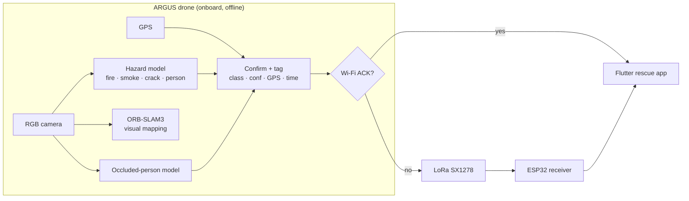
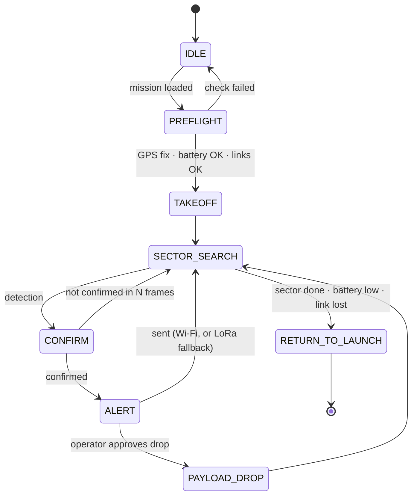

# ARGUS Architecture

**Status key:** ✅ Demonstrated · 🔧 In development · 📋 Planned

## 1. System overview



| Block | Status |
|---|---|
| Hazard model (`disaster-mlmodel.pt`) | ✅ trained and validated |
| Occluded-person model (`occluded-mlmodel.pt`) | ✅ trained |
| ORB-SLAM3 monocular mapping | ✅ laptop webcam |
| Onboard inference on Pi 5 | 🔧 |
| Wi-Fi + LoRa alert link, Flutter app | 🔧 |
| Thermal, acoustic, priority score, flight | 📋 |

## 2. Mission state machine (planned)



**Failsafes:** low battery or loss of the control link always wins and triggers
`RETURN_TO_LAUNCH` (handled by ArduPilot on the flight controller, not the Pi).

## 3. Payload drop safety rule (planned)

If a payload (first-aid kit, radio, water) is added, the drop must pass **all** of these checks:

1. **Operator approval.** A human confirms every drop in the app. The drone never drops on its own.
2. **Target clear.** No survivor detected directly below the release point
   (never drop onto a person).
3. **Safe height and speed.** Altitude within the safe drop range (from TF-Luna) and the
   drone hovering, not moving.
4. **Logged.** Every drop is recorded with time and GPS.

If any check fails, the drop is refused and the reason is shown to the operator.

## 4. Survivor location

- **Today:** the alert carries the **drone's** GPS at the moment of detection.
- **Planned:** project the survivor's position from:
  - drone GPS and **heading** (needs a magnetometer; the MPU6050 has no compass),
  - the detection's horizontal offset in the image (camera field of view),
  - **range** to the target (TF-Luna, or altitude and camera angle).

```python
def survivor_gps(lat, lon, heading_deg, range_m, box_cx, img_w, hfov_deg=62.2):
    offset = (box_cx - img_w / 2) / (img_w / 2) * (hfov_deg / 2)
    bearing = math.radians(heading_deg + offset)
    dn, de = range_m * math.cos(bearing), range_m * math.sin(bearing)
    return lat + dn / 111320, lon + de / (111320 * math.cos(math.radians(lat)))
```

## 5. What this system is not (yet)

- **Not LiDAR SLAM.** ORB-SLAM3 here is camera-only (monocular). It builds a sparse map
  with the right shape but **no true scale**. The TF-Luna is a single-point rangefinder
  used for altitude; it cannot build a map.
- **Not flying yet.** No flight tests have been done. The quadcopter shape in the SLAM viewer
  is a marker for the camera position, not a drone.
- **Not seeing through rubble.** RGB (and planned thermal) detection finds people who are
  visible or partly exposed. Nothing in ARGUS sees through concrete.
- **Not a replacement for rescuers.** Every alert is verified by a human.
